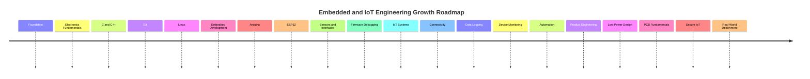
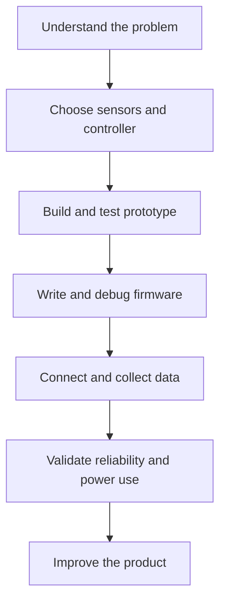

<!-- ========================= -->
<!--      PROFILE HEADER       -->
<!-- ========================= -->

<div align="center">


<br/>

<a href="https://github.com/ADCodes1">
  
</a>
<a href="https://github.com/ADCodes1?tab=repositories">
  
</a>
<a href="https://github.com/ADCodes1/ADCodes1/issues">
  
</a>

<br/><br/>


<br/><br/>

<a href="https://git.io/typing-svg">
  
</a>

</div>

---

<!-- ========================= -->
<!--        INTRODUCTION       -->
<!-- ========================= -->

<table>
<tr>
<td width="65%" valign="top">

## 👋 About Me

I am **Arati Sanju Dhore**, an Electronics and Telecommunication Engineer interested in **embedded systems, IoT, firmware development, and intelligent hardware products**.

I enjoy turning an idea into a working prototype by connecting electronics, sensors, microcontrollers, software, and a clear user purpose. My goal is to build reliable, practical systems that solve real-world problems.

My current focus combines:

* Embedded C/C++ and microcontroller programming
* Arduino and ESP32-based IoT prototypes
* Sensor integration and hardware-software interfacing
* Python for automation, data processing, and prototypes
* Connected devices, wearables, and low-power systems

</td>

<td width="35%" valign="top">

## ⚡ Engineer Snapshot

```yaml
Name: Arati Sanju Dhore
Username: ADCodes1
Field: Electronics & Telecommunication

Focus:
  - Embedded Systems
  - Internet of Things
  - Firmware Development
  - Smart Wearables

Main Stack:
  - C / C++
  - Python
  - Arduino
  - ESP32
  - JavaScript

Current Goal:
  Build dependable connected
  hardware products
```

</td>
</tr>
</table>

---

## 🚀 What I Build

<table>
<tr>
<td width="33%" align="center" valign="top">

### ⚙️ Embedded Systems

Developing microcontroller-based prototypes with:

`C / C++`

`Arduino`

`ESP32`

`Sensors`

`Actuators`

`Serial Communication`

</td>

<td width="33%" align="center" valign="top">

### 📡 IoT Solutions

Connecting devices and collecting meaningful data through:

`Wi-Fi Connectivity`

`Sensor Networks`

`Cloud Dashboards`

`Device Monitoring`

`Automation`

`Real-time Alerts`

</td>

<td width="33%" align="center" valign="top">

### 🧪 Hardware Prototyping

Designing, testing, and improving practical ideas with:

`Wearables`

`Circuit Prototyping`

`Power Management`

`Data Logging`

`Testing`

`Iteration`

</td>
</tr>
</table>

---

## 🎯 Current Mission

<table>
<tr>
<td width="50%" valign="top">

### Currently Building

* Embedded and IoT prototypes
* Sensor-driven monitoring systems
* ESP32 and Arduino firmware projects
* Connected-device experiments
* Hardware and software integrations
* Practical electronics projects for everyday problems

</td>

<td width="50%" valign="top">

### Currently Learning

* Advanced embedded C/C++
* ESP32 communication and networking
* IoT cloud platforms and dashboards
* Low-power design principles
* PCB design fundamentals
* RTOS concepts and task scheduling
* Embedded Linux basics
* Secure IoT device design

</td>
</tr>
</table>

---

## 🧠 Technology Universe

<div align="center">

<p>
  
</p>

</div>

<details open>
<summary><h3>⚙️ Embedded Systems and Firmware</h3></summary>

<br/>

<div align="center">


<br/><br/>


</div>

<br/>

| Area | Focus |
| --- | --- |
| Microcontrollers | Arduino, ESP32, GPIO, timers, interrupts |
| Firmware | Embedded C/C++, modular code, debugging |
| Hardware interfaces | Sensors, actuators, displays, serial communication |
| Communication | UART, I2C, SPI, Wi-Fi and Bluetooth concepts |
| Reliability | Input validation, error handling, testing and logging |
| Power | Low-power thinking, battery-aware design and sleep modes |

</details>

<details open>
<summary><h3>📡 IoT, Sensors and Connected Devices</h3></summary>

<br/>

<div align="center">


</div>

<br/>

| Capability | Practical Application |
| --- | --- |
| Sensor data | Reading, filtering, and interpreting environmental or device signals |
| Connectivity | Sending device data through Wi-Fi-based IoT connections |
| Monitoring | Making device status and data visible to users |
| Automation | Triggering useful actions from sensor conditions |
| Alerts | Informing users when data crosses a meaningful threshold |
| Prototyping | Testing an idea quickly before improving its hardware design |

</details>

<details>
<summary><h3>💻 Software, Data and Interfaces</h3></summary>

<br/>

<div align="center">


</div>

<br/>

<table>
<tr>
<td width="33%" valign="top">

### Programming

* C and C++
* Python
* JavaScript
* Data structures basics
* Debugging and testing
* Version control with Git

</td>

<td width="33%" valign="top">

### Data and Automation

* Sensor data collection
* Data logging
* Python scripting
* Data cleaning basics
* Device-status reporting
* Automation workflows

</td>

<td width="33%" valign="top">

### Interfaces

* Web interface fundamentals
* React basics
* Device-control concepts
* Dashboard concepts
* Clear user feedback
* Responsive design basics

</td>
</tr>
</table>

</details>

---

## 🗺️ Engineering Roadmap



## ⚙️ How I Build Hardware Products



---

## 📌 Learning Focus

| Area | Current Focus |
| --- | --- |
| Embedded programming | Writing clear, modular C/C++ firmware |
| Microcontrollers | Arduino and ESP32 prototypes |
| Sensors | Reliable readings, calibration, and integration |
| IoT | Wi-Fi connectivity, device communication, monitoring |
| Power design | Battery awareness and low-power strategies |
| Hardware development | Circuit and PCB design fundamentals |
| Engineering workflow | Testing, documentation, Git, and iteration |

---

<div align="center">

## 📊 GitHub Command Center


<br/>


</div>

---

## 💡 Engineering Principles

<table>
<tr>
<td width="25%" align="center">

### Build

Turn ideas into working prototypes.

</td>
<td width="25%" align="center">

### Test

Validate hardware, firmware, and data.

</td>
<td width="25%" align="center">

### Improve

Iterate for reliability, efficiency, and usability.

</td>
<td width="25%" align="center">

### Document

Make projects understandable and reproducible.

</td>
</tr>
</table>

---

<div align="center">

## 🤝 Collaborate & Explore

I am interested in collaborating on embedded systems, IoT prototypes, sensor-based monitoring, smart wearables, and practical electronics projects.

<br/>

<a href="https://github.com/ADCodes1">
  
</a>
<a href="https://github.com/ADCodes1/ADCodes1/issues">
  
</a>

<br/><br/>

> **Build thoughtfully. Test carefully. Connect intelligently.**

<br/>


</div>
